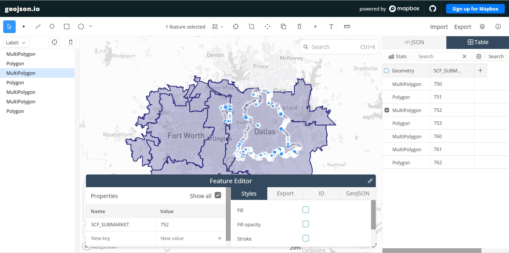

# SCF SUBMARKET TOOLKIT



Rendering of the Dallas-Tarrant (Fort Worth) SCF map on geojson.io

## Description
The SCF Submarket Toolkit is a Python data-engineering pipeline designed to transform raw, localized U.S. Census Bureau ZIP Code Tabulation Areas (ZCTAs), which approximate USPS ZIP codes, into unified, macro-level geographic submarkets in Texas. It is specifically engineered to resolve the spatial ambiguities which occur when federal postal routes intersect with rigid county boundaries.

In commercial logistics, submarkets are often defined by the first three digits of a ZIP code, known as the Sectional Center Facility (SCF) prefix. However, because ZIP codes are designed for mail delivery trucks rather than for municipal politics, they frequently bleed across county lines. This creates overlapping geometries and inaccurate data aggregation when attempting to analyze a single county or a specific Metropolitan Statistical Area (MSA).

This toolkit solves the aforementioned problem programmatically. It ingests county shapefiles from the Texas Department of Transportation (TxDOT) and ZCTA layers from the federal Census Bureau, filters them to a targeted regional footprint and performs a spatial join (intersects) to keep full ZCTA geometries which touch the target counties. Finally, it uses GeoPandas' dissolve() method to melt the inside boundaries of matching 5-digit ZIP codes, creating clean, mutually exclusive 3-digit SCF MultiPolygons.


## Dependency Management
This project leverages [uv](https://github.com/astral-sh/uv) for lightning-fast, reproducible virtual environments and dependency locking.

To spin up the environment and run the toolkit instantly:
```bash
pip install uv
uv sync
```


## File structure and architecture
This project was architected with an emphasis on readability through separation of concerns, as well as exactness and memory optimization in execution.
> **CRITICAL PREREQUISITE:** THE TWO SHAPEFILES BELOW MUST BE DOWNLOADED AND UNZIPPED TO RUN THE TOOLKIT FLAWLESSLY.
> 
> - `txdot_county_detailed_tx.shp`: Texas State & County Boundaries shapefile from 2025, located in the tx-boundaries_48_bnd/ file directory. The latter is downloadable as .zip from the Texas Natural Resources Information System (TNRIS) at https://data.tnris.org/collection/?c=c439cfd8-4966-490f-9eea-eb2a8a11a3bd. 
> 
> - `tl_2025_us_zcta520.shp`: The TIGER/Line Shapefiles for U.S. ZCTAs, located in the tl_2025_us_zcta520/ file directory. The latter is downloadable as .zip in the U.S. Census Bureau's website: https://www.census.gov/cgi-bin/geo/shapefiles/index.php?year=2025&layergroup=ZIP+Code+Tabulation+Areas.

* `scf_toolkit.py`: The core engine, containing the sequential data-processing pipeline and main(). Key functions include:
    * `resolve_secure_path`: A custom firewall which anchors relative pathways to the script's directory.
    * `extract_bounded_zctas`: Instead of loading the massive federal ZCTA database into RAM, this function uses a bounding box (`bbox`) to slice only the relevant regional geometries during the initial disk read.
    * `sjoin_gdfs_in_3081`: Forces a standardized reprojection to `EPSG:3081` on both ZCTA and counties `GeoDataFrames` (GDFs). This ensures both GDFs are in the same Coordinate Reference System (CRS) to be spatially joined, keeping only the ZIP codes intersecting the target counties.
    * `dissolve_by_scf`: The core of the tool, it groups the remaining geometries by their 3-digit prefix and merges them into unified spatial assets.

* `test_scf.py`: A pytest suite containing nine distinct integration and unit tests. Rather than relying on heavy on-disk shapefiles, the unit tests use shapely.geometry primitives and monkeypatches to check functional logic (such as column validation and spatial dropping) fully in-memory. The suite concludes with a master integration test that uses the tmp_path fixture to perform a true disk-to-disk sandbox execution without polluting the main workspace.

* `requirements.txt`: Contains the strict dependencies required to run the pipeline, primarily geopandas and pytest.


## Design choices
Throughout the development of the toolkit, I made two key architectural decisions to prioritize readability and accuracy:

1. Spatial Join vs Clipping: Early iterations considered using `geopandas.clip()` exactly at the county line. This approach was discarded because it fundamentally changes the true geometry of the ZCTA and creates artificial "slivers" of ZIP codes. Instead, sjoin(predicate='intersects') was chosen to retain the entire organic geometry of any given ZIP code touching a given county.

2. Dynamic reprojection: The pipeline explicitly reprojects data into `EPSG:3081` (Texas State Mapping System, Lambert Conformal Conic) for physical accuracy during the spatial joining. However, right before generating the GeoJSON output file, the GDF is converted to `EPSG:4326` (World Geodetic System/WGS 84) to be instantly compatible with web-mapping frameworks like Leaflet, geojson.io and Mapbox.


This pipeline demonstrates the core extraction, intersection, dissolve and output pattern for building custom geographic layers from raw public data. The engine's structure is designed to be agnostic.